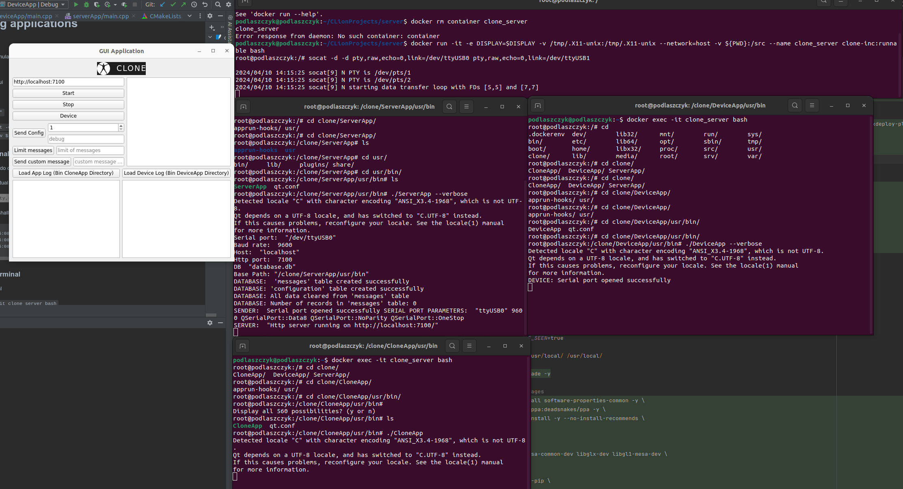
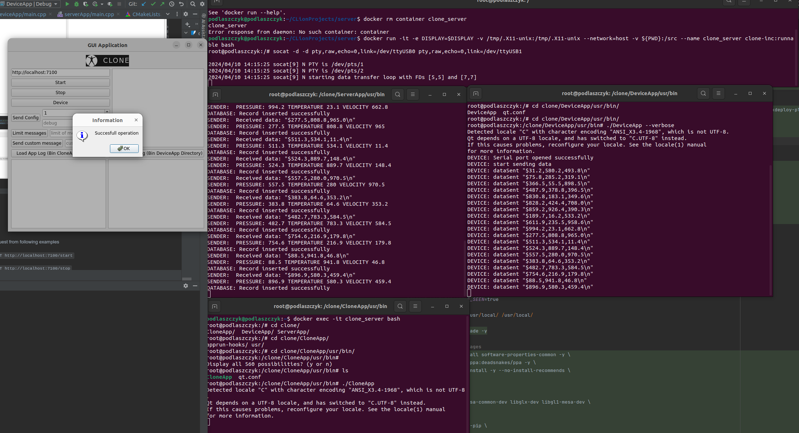
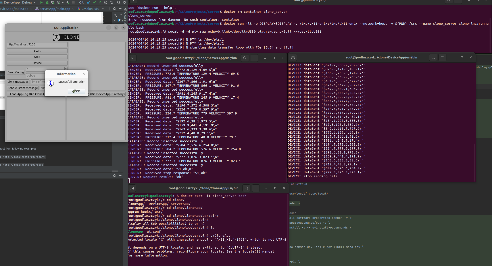
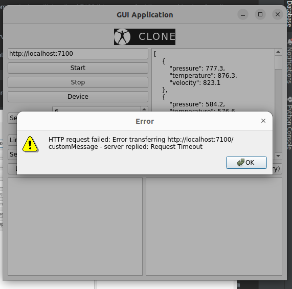
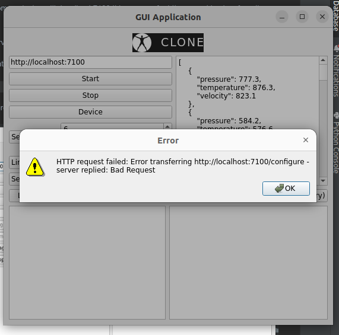
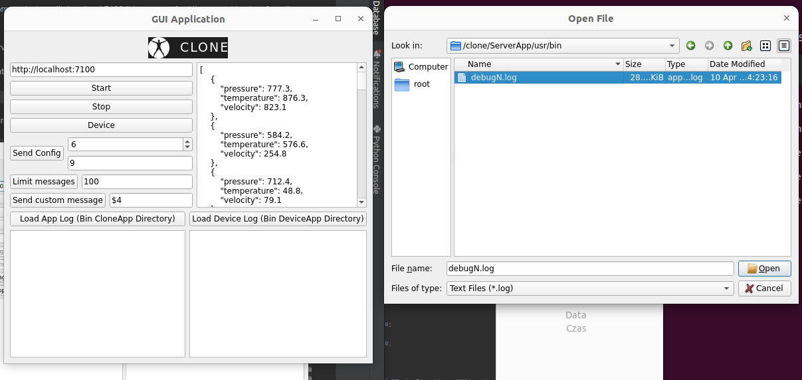
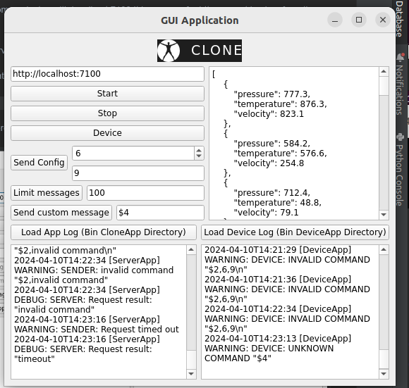
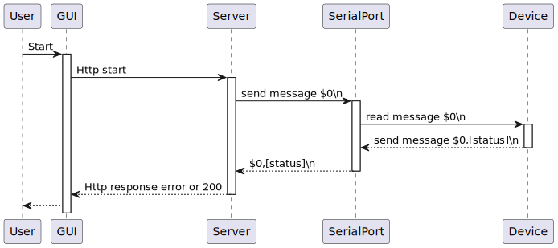

# build image

### build command

```docker build --target RunnableStage -t clone-inc:runnable . ```

```docker build --target BuildServerCodeStage -t clone-inc:build . ```

Dockerfile contains 3 stages
If you need just runnable use runnable image. It is does not contain dev packages.

If you want to work with codebase execute build image.

# Running applications

Open 4 terminals

1. For socat simulation
2. For device
3. For server
4. For curl or gui

For gui enabled:

```xhost +local:*```

```docker run -it -e DISPLAY=$DISPLAY -v /tmp/.X11-unix:/tmp/.X11-unix --network=host -v ${PWD}:/src --name clone_server clone-inc:runnable bash```


### In first terminal call:

socat requires sudo on /dev/*

when creating virtual port remember which port is created. In this case /dev/ttyUSB0

```socat -d -d pty,raw,echo=0,link=/dev/ttyUSB0 pty,raw,echo=0,link=/dev/ttyUSB1```

Example output shall appear

```
2024/04/08 15:08:31 socat[239] N PTY is /dev/pts/2
2024/04/08 15:08:31 socat[239] N PTY is /dev/pts/3
2024/04/08 15:08:31 socat[239] N starting data transfer loop with FDs [5,5] and [7,7]
```

### In second terminal

open 2cd terminal

```docker exec -it clone_server bash```

```cd /clone/ServerApp/usr/bin```

``` ./ServerApp --help```

should receive

```Options:
  -h, --help             Displays help on commandline options.
  --help-all             Displays help including Qt specific options.
  -v, --verbose          Enable verbose output to console
  --port <port>          Set serial port name (/dev/ttyUSB0).
  --baudrate <baudrate>  Set baud rate (e.g., 9600, 115200).
  --host <host>          Set host address (e.g 127.0.0.1) 
  --httpPort <httpPort>  Set httpPort (e.g 7100) 
  --db <db>              Set db (e.g database.db) 
```

calling

```./ServerApp --verbose```

shall receive

```
Serial port:  "/dev/ttyUSB0"
Baud rate:  9600
Host:  "localhost"
Http port:  7100
DB  "database.db"
Base Path: "/clone/ServerApp/usr/bin"
DATABASE:  'messages' table created successfully
DATABASE: 'configuration' table created successfully
DATABASE: All data cleared from 'messages' table
DATABASE: Number of records in 'messages' table: 0
SENDER:  Serial port opened successfully SERIAL PORT PARAMETERS:  "ttyUSB0" 9600 QSerialPort::Data8 QSerialPort::NoParity QSerialPort::OneStop
SERVER:  "Http server running on http://localhost:7100/"
```

in case of

```SENDER:  Failed to open serial port: "Device or resource busy" SERIAL PORT PARAMETERS:  "ttyUSB0" 9600 QSerialPort::Data8 QSerialPort::NoParity QSerialPort::OneStop```

try to restart creation of virtual port in the first terminal

might also require sudo if connecting to /dev/ for not root user

### In third terminal

open 3rd terminal

```docker exec -it clone_server bash```

```cd /clone/DeviceApp/usr/bin```

```./DeviceApp --verbose```

shall receive

```
DEVICE: Serial port opened successfully
```

might requires sudo if connecting to /dev/

### In fourth terminal

open 4th terminal

```docker exec -it clone_server bash```

```cd /clone/CloneApp/usr/bin```

```./CloneApp```

GUI by default communicates with localhost:7100
It is wrapper for http request in nicer form than curl.

If you opened server with different host addres and port paste it here.

To check where http server is running see 2cd terminal.

```SERVER:  "Http server running on http://localhost:7100/"```

Instead of gui there is an option of sending requests with curl.




U can press Start, Stop, Device to send requests.










too load logs instead of looking at console press Load App Log
and chose correct dir




simulate http request from following examples

```curl -i -X GET http://localhost:7100/start```

```curl -i -X GET http://localhost:7100/stop```

```curl -i -X PUT -d "frequency=1&debug=false" http://localhost:7100/configure```

```curl -i -X GET http://localhost:7100/device```

```curl -i -X GET http://localhost:7100/messages?limit=5```

# configure and build app in build container

### enter container

```docker run -it -e DISPLAY=$DISPLAY -v /tmp/.X11-unix:/tmp/.X11-unix --network=host -v ${PWD}:/src --name clone_server_build clone-inc:build bash```

### cmake configure && build && create deploy tars

```cd src/ ```

```mkdir build && cd build ```

```cmake .. -G Ninja -DCMAKE_PREFIX_PATH="/usr/local/Qt/6.5.3/gcc_64/"```

``` cmake --build . ```

```cmake --build . --target PackagedeviceApp```

```cmake --build . --target Packagegui```

```cmake --build . --target PackagecloneApp```

# General comments:

- image contains catch2 and fakeit for testing, however signal slot mechanism is not easily mockable
- data is logged to file everytime qDebug or qWarning is called. This shall be optimized. Saving to file or std shall be
  cached and then logged periodically.
- there are bottlenecks if device sends a lot of data and server cannot process it and sending stop does not work.
  Logging in other thread is an option.
- server requires testing for various test cases e.g. changing baudrates, ports
- cli enables to set parameters but was not tested properly
- runnable size image can be reduced
- server shall be called as a microservice when docker container is starting
- maybe docker swarm for device and server in other containers with mounted volumes
- docker to podman is also a way to go
- class interfaces are not designed in TDD way, they do not take abstraction thus it was complicated then to test it
  with other serialport class.
- image shall contain also clang-tidy and other tools for code-quality checking
- in my case CLion showed potential issue on the fly
- more sequence and class diagrams could be added for presenting logic for each test case

  


