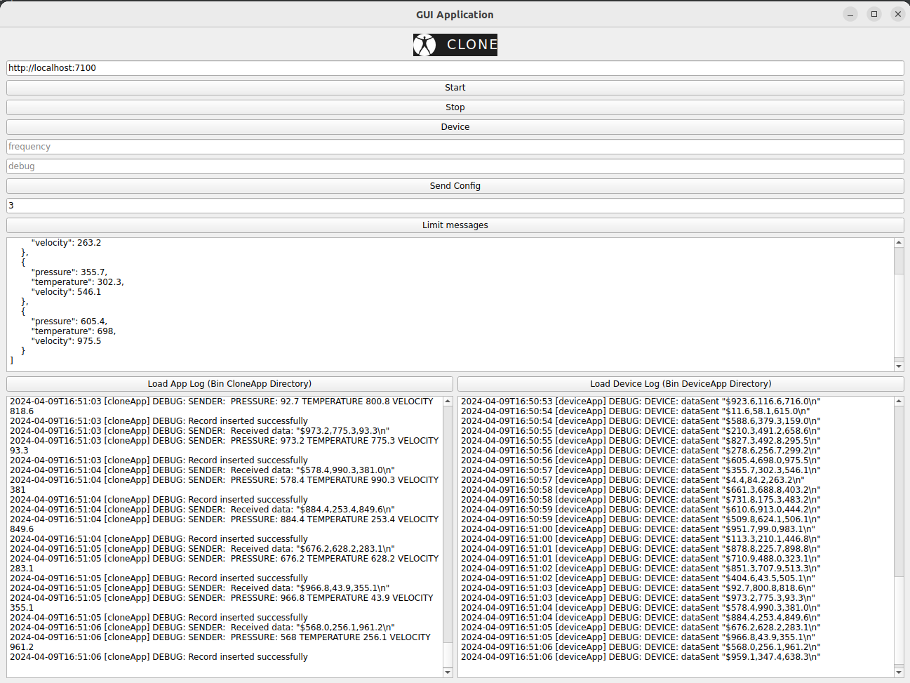

# build image

Currently image is around 1.1 GB. This is development image. There is possibility to reduce number of unecessary
dependencies.

### example build command

```docker build -t server_image_smaller .```

# configure and build app

### enter container

```docker run -it -v ${PWD}:/src --name clone_server server_image_smaller:latest```

### cmake configure && build && create deploy tars

```cd src/ ```

```mkdir build && cd build ```

```cmake .. -G Ninja -DCMAKE_PREFIX_PATH="/usr/local/Qt/6.5.3/gcc_64/"```

``` cmake --build . ```

```cmake --build . --target PackagedeviceApp```

```cmake --build . --target Packagegui```

```cmake --build . --target PackagecloneApp```

# Manual testing

Open 4 terminals

1. For socat simulation
2. For device
3. For server
4. For curl or gui

For gui enabled:

```xhost +local:*```

```docker run -it -e DISPLAY=$DISPLAY -v /tmp/.X11-unix:/tmp/.X11-unix --network=host -v ${PWD}:/src --name clone_server server_image_smaller bash```

or

```docker exec -it clone_server bash```

### In first terminal call:

socat requires sudo on /dev/*

```socat -d -d pty,raw,echo=0,link=/dev/ttyUSB0 pty,raw,echo=0,link=/dev/ttyUSB1```

Example output shall appear

```
2024/04/08 15:08:31 socat[239] N PTY is /dev/pts/2
2024/04/08 15:08:31 socat[239] N PTY is /dev/pts/3
2024/04/08 15:08:31 socat[239] N starting data transfer loop with FDs [5,5] and [7,7]
```

### In second terminal

```cd src/build/app && ./cloneApp```

might requires sudo if connecting to /dev/

### In third terminal

```cd src/build/device && ./deviceApp```

might requires sudo if connecting to /dev/

### In fourth terminal

simulate http request from following examples

```curl -i -X GET http://localhost:7100/start```

```curl -i -X GET http://localhost:7100/stop```

```curl -i -X PUT -d "frequency=1&debug=false" http://localhost:7100/configure```

```curl -i -X GET http://localhost:7100/device```

```curl -i -X GET http://localhost:7100/messages?limit=5```

or call gui from

```./src/build/GUI/gui```


